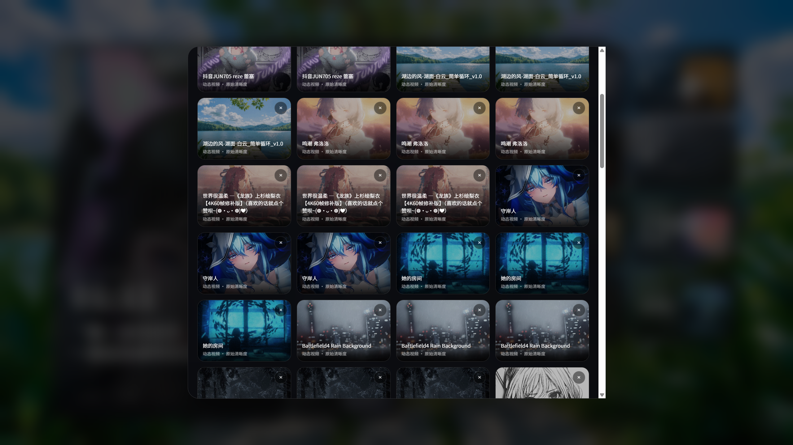

# Mineradio - LX Music（落雪音乐）/ MR

MR 是一个可独立运行的桌面音乐播放器与音乐可视化工具。安装后即可扫描并播放用户自己的本地音乐，不需要安装 LX Music，也不需要开启或调用 LX Music 开放 API。

LX Music 歌单导入和本机联动属于可选扩展能力，不影响 MR 独立播放本地音乐。MR 不包含、不分发 LX Music，不内置音乐音源，也不提供或分发任何受版权保护的音频内容。

## Mineradio 1.5.2

[下载 Windows 安装包](https://github.com/ww085213/Mineradio-LX-Music/releases/download/v1.5.2/Mineradio.Setup.1.5.2.exe) · [查看完整发布说明](https://github.com/ww085213/Mineradio-LX-Music/releases/tag/v1.5.2)

> Windows x64 版本，支持自选安装目录。安装包暂未使用商业代码签名，首次运行时 Windows 可能显示安全提醒。

## GitHub 项目描述

MR 是一个可独立运行的桌面音乐播放器，支持本地音乐库、本地播放队列、歌词舞台、桌面歌词和 3D 音乐可视化。用户无需安装 LX Music 或开启开放 API；LX Music 歌单导入与本机联动仅作为可选扩展功能。

## 界面示例

> 以下截图仅用于展示 MR 的界面形态和本机联动效果。截图中的歌曲名、歌手名、专辑封面、歌单封面、壁纸图片或视频画面均来自用户本机环境或第三方软件显示内容，不代表本仓库内置、分发或授权这些内容，相关版权归各自权利人所有。

### 独立播放首页、歌单浏览与自定义背景


### 独立搜索与直接播放


### Wallpaper Engine 壁纸库



### 播放态粒子与音乐可视化


## 原项目、作者与版权声明

- 本项目基于原作者 [@XxHuberrr](https://github.com/XxHuberrr) 的开源项目 [XxHuberrr/Mineradio](https://github.com/XxHuberrr/Mineradio) 进行二次开发。感谢原作者及原项目贡献者；本仓库不会抹去或替代原作者署名。
- 原项目与本项目均依据仓库内的 MIT License 使用和分发。二次开发部分由本仓库维护者负责，不代表原作者为本版本提供背书、维护或担保。
- 感谢 [@lyswhut/lx-music-desktop](https://github.com/lyswhut/lx-music-desktop) / LX Music。LX Music 相关名称仅用于说明兼容或可选联动能力；本项目不是 LX Music 官方产品，也不包含、不分发 LX Music 程序本体。
- MR 不提供音乐音源，不绕过任何平台权限，不随仓库分发歌曲文件、专辑封面、歌单数据、壁纸素材或受版权保护的音频内容。
- 用户应仅播放、导入或展示自己有权使用的音乐、歌词、封面和壁纸。相关内容的版权责任由内容提供者和使用者自行承担。

## 核心定位

- 本地音乐播放器
- 无需第三方播放器或 LX Music API 的独立播放
- 可选的 LX Music 歌单导入与本机联动
- 歌词舞台与桌面歌词播放器
- 3D 歌单架和音乐可视化桌面体验

## Mineradio 1.5.2 新版亮点

1.5.2 是面向歌单管理、音源导入和跨平台歌单体验的维护增强版本，主要更新包括：

- 主页歌单支持拖动调整顺序，用户可以按自己的听歌习惯整理本地歌单、文件夹歌单和 LX 歌单。
- 左侧“本地库”同步主页歌单顺序，主页排序后侧栏浏览顺序保持一致。
- 优化主页歌单拖拽交互，改用更稳定的指针拖动逻辑，减少 Electron 环境下原生拖放不触发的问题。
- 修复左侧歌单列表在部分筛选状态下被清空的问题。
- 放宽落雪兼容音源导入校验，支持更多混淆写法和 `globalThis['lx']` / 十六进制属性访问形式。
- 兼容第三方音源注册的可选 LX 事件，避免非必要事件导致导入失败。
- 保留真实沙箱初始化校验，坏文件仍会被拦截，已验证 2026 年 5 月 4 日音源包内 14 个脚本可正常导入。
- 继续保留本地播放、平台歌单导入、3D 歌单架、桌面歌词、壁纸和视觉参数等 1.5.x 功能。

## Mineradio 1.4.7 新版亮点

1.4.7 是面向本地音乐和 LX Music 本机连接体验的新版，主要更新与特色包括：

- 独立播放：无需登录平台账号、无需安装 LX Music、无需开启 LX Music API，即可使用本地音乐核心功能。
- 本地音乐优先：加强本地文件夹扫描、本地音乐库、本地歌单和本地播放队列。
- LX Music 可选联动：需要时可读取用户主动开启的本机接口；不启用时不影响独立播放。
- `.lxmc` 歌单导入：支持导入 LX Music 歌单文件，并在 MR 中浏览和播放。
- 多行歌词舞台：支持当前句、下一句、远端预览句的多句歌词显示。
- 歌词翻译：支持读取并显示翻译歌词，可在界面中单独开关。
- 歌词时间偏移：可调整歌词提前/延后，适配不同来源的歌词时间轴。
- 旧歌词拦截：针对 LX Music 切歌后歌词接口滞后的情况，避免上一首歌词套到当前歌曲。
- URL 过期兜底：针对 LX Music 播放 URL 过期提示，加入重新发送当前歌曲的兜底逻辑。
- 桌面歌词增强：支持桌面歌词窗口、点击穿透、高亮跟随和歌词视觉控制。
- Wallpaper Engine 背景：支持读取并应用 Wallpaper Engine 壁纸作为 MR 背景。
- 自定义壁纸优先：未播放首页不会强行覆盖用户壁纸，只叠加轻星河氛围。
- 背景媒体增强：支持本地图片、本地视频、封面背景和 Wallpaper Engine 背景。
- 3D 歌单架增强：支持右键唤起、歌单队列浏览、默认视角预设和歌单内容筛选。
- 默认视角预设：支持自动、歌词正面、歌单侧栏、电影远景。
- 歌单显示筛选：支持全部、本地、LX Music、我的歌单。
- 均衡器与音效预设：加入 EQ 开关、预设和多段调节。
- 沉浸模式增强：支持沉浸模式自动全屏。
- 长播客 / DJ 视觉：针对长音频、播客和 DJ 曲目加入更平稳的视觉模式。
- 本地格式扩展：补充 WAV、M4A、OGG 等格式支持。
- 播放稳定性：完善播放切换、异常歌曲识别和播放器状态恢复逻辑。
- 音源与搜索：补充 LX 音源解析、搜索和平台歌单导入模块。
- 开源发布清理：源码仓库不包含 Electron 运行时、歌曲文件、音源配置或个人缓存；安装包单独通过 Releases 发布。

## 支持的音乐来源

- 本地音乐文件
  - MP3
  - FLAC
  - WAV
  - M4A
  - OGG
- 本地文件夹音乐库
- 本地自建歌单
- LX Music 歌单导入
- LX Music 本机开放 API / 本机协议联动
- LX Music 歌词同步与翻译歌词显示

## 独立播放与可选联动

MR 的本地音乐播放、歌单、歌词、音效和可视化功能可以独立使用，不依赖 LX Music，不调用 LX Music API，也不要求登录任何音乐平台账号。

如果用户希望使用 LX Music 本机联动，可自行安装 LX Music 并主动开启其开放 API；MR 仅在用户启用相关功能时读取本机接口。`.lxmc` 歌单导入同样是可选功能。

MR 不会内置或打包 LX Music，不会提供音乐音源，也不会随仓库发布歌曲文件。任何扩展数据源均应由用户自行合法配置和使用。

## 主要功能

### 本地播放

- 扫描本地文件夹并建立音乐库
- 支持本地歌曲队列播放
- 支持本地歌单收藏和管理
- 支持重复、顺序、随机等播放模式
- 支持本地封面读取
- 支持本地歌词读取
- 支持播放进度、音量、上一首、下一首等基础控制

### LX Music 本机连接

- 导入 LX Music `.lxmc` 歌单
- 读取用户本机 LX Music 开放 API 提供的歌单列表
- 调用用户本机 LX Music 播放当前歌曲
- 同步 LX Music 播放状态
- 同步封面、标题、歌手、时长和进度
- 同步歌词
- 支持翻译歌词显示/隐藏
- 针对播放 URL 过期状态做自动重发歌曲兜底
- 针对切歌后歌词接口滞后做旧歌词拦截与重试

### 歌词系统

- 3D 歌词舞台
- 多句歌词预览
- 歌词翻译显示/隐藏
- 歌词时间偏移调节
- 歌词大小、位置、行距、字距调节
- 歌词颜色和高亮颜色设置
- 歌词发光、节拍发光和粒子效果
- 自定义歌词导入
- 桌面歌词窗口
- 桌面歌词点击穿透
- 桌面歌词高亮跟随

### 视觉与可视化

- Emily / 默认播放态视觉
- 未播放首页氛围视觉
- 自定义壁纸优先的首页背景逻辑
- 歌词舞台与粒子舞台同步
- 节奏驱动的电影镜头
- 音频能量粒子
- 封面色彩提取
- 背景虚化与封面背景
- 播放态视觉预设
- 空闲态星河氛围
- 自定义视觉参数保存

### 3D 歌单架

- 右键唤起 3D 歌单架
- 歌单队列浏览
- 本地歌单展示
- LX Music 歌单展示
- 文件夹歌单展示
- 歌单架内容筛选：全部、本地、LX Music、我的歌单
- 默认视角预设：自动、歌词正面、歌单侧栏、电影远景
- 歌单架颜色调节

### 背景与壁纸

- 本地图片背景
- 本地视频背景
- Wallpaper Engine 背景读取
- 壁纸柔化显示
- 自定义壁纸优先
- 未播放时保留用户壁纸，只叠加轻星河氛围
- 播放后切换播放态前景视觉，不强行覆盖用户背景
- 封面背景模式

### 音效

- 均衡器
- 音效预设
- 预增益控制
- 多段 EQ 调节
- 音效开关

### 播客 / DJ / 长音频体验

- 长播客和 DJ 曲目专属视觉模式
- 更平稳的长音频镜头表现
- 低频与节奏驱动的 DJ 视觉
- 播放队列内长音频识别和适配

### 桌面体验

- Electron 桌面窗口
- 桌面歌词窗口
- 沉浸模式
- 沉浸模式自动全屏
- 迷你队列
- 控制栏自动隐藏
- 托盘 / 窗口壳相关基础能力

### 更新

- GitHub Releases 更新检测入口
- 快速补丁下载入口
- 镜像加速配置

## 不包含什么

MR 不包含以下内容：

- LX Music 程序本体
- 音乐音源
- 歌曲、专辑或其他受版权保护的音频内容
- 网易云音乐账号登录
- QQ 音乐账号登录
- 官方平台收藏同步
- 官方平台会员能力

无需 LX Music 即可独立播放用户自己的本地音乐。涉及第三方平台、扩展数据源或在线内容时，用户应遵守相应服务条款和版权规则；MR 不提供、托管或授权这些内容。

## 开发运行

```bash
npm install
npm run dev
```

## 打包

```bash
npm run dist
```

打包产物会输出到 `dist/`。

## 发布仓库

默认发布仓库配置为 `ww085213/Mineradio-LX-Music`。如果你 fork 或迁移到其它仓库，请同步修改 `package.json` 里的 `homepage`、`repository.url`、`bugs.url` 和 `mineradio.update` 配置。

## 开源说明

本仓库只包含源码和必要静态资源，不包含 Electron/Chromium 运行时、安装包、用户本地缓存、歌单数据、音源配置、歌曲文件或个人配置。

第三方库和资源保留各自许可证。`public/vendor/` 中的库文件请按照对应许可证使用。

## License

MIT
